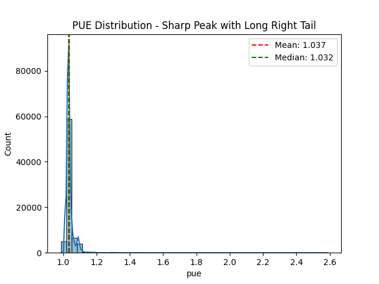
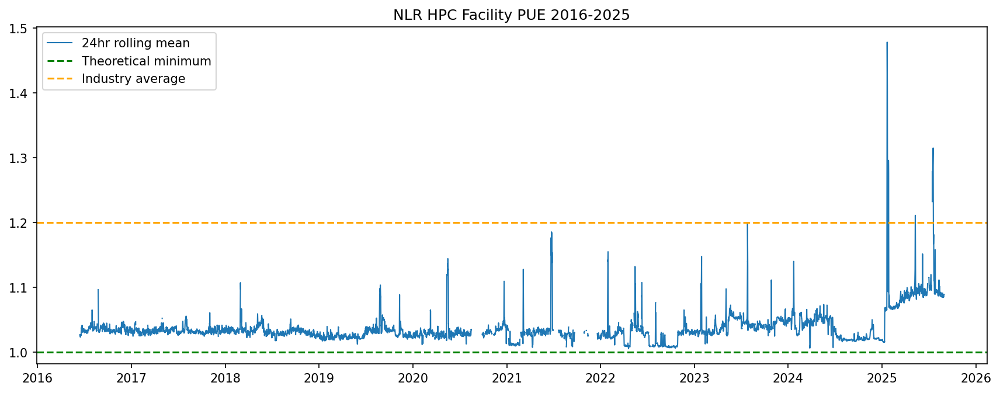
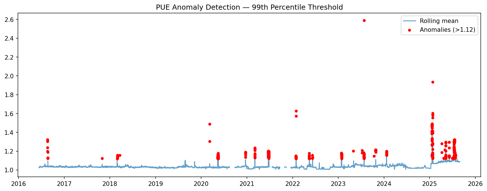
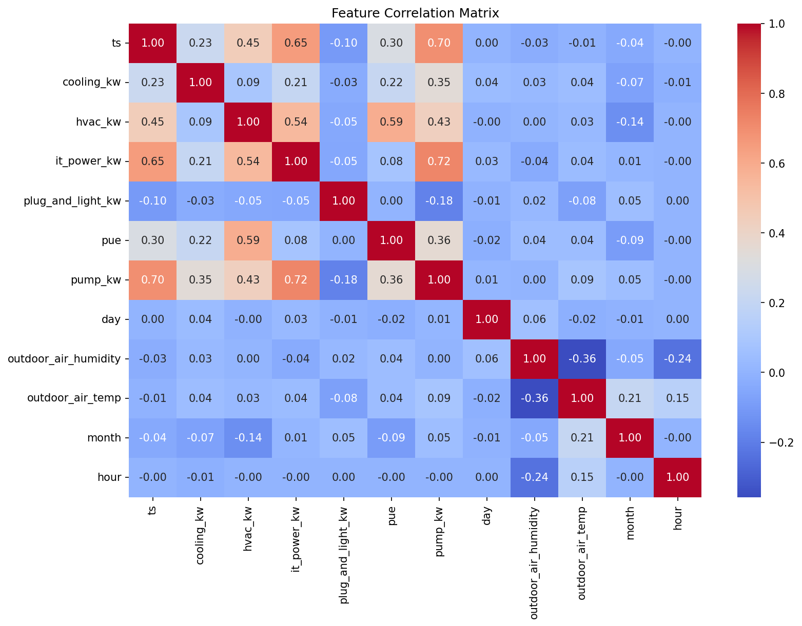
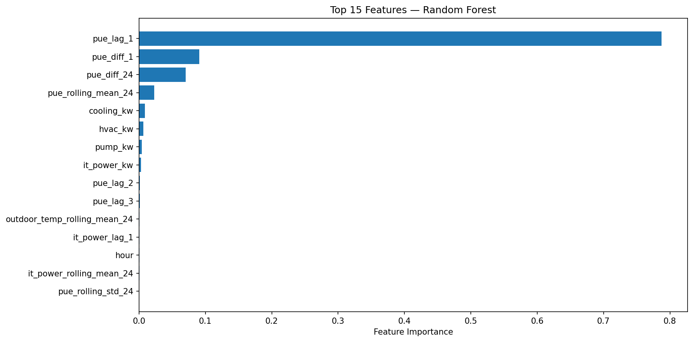
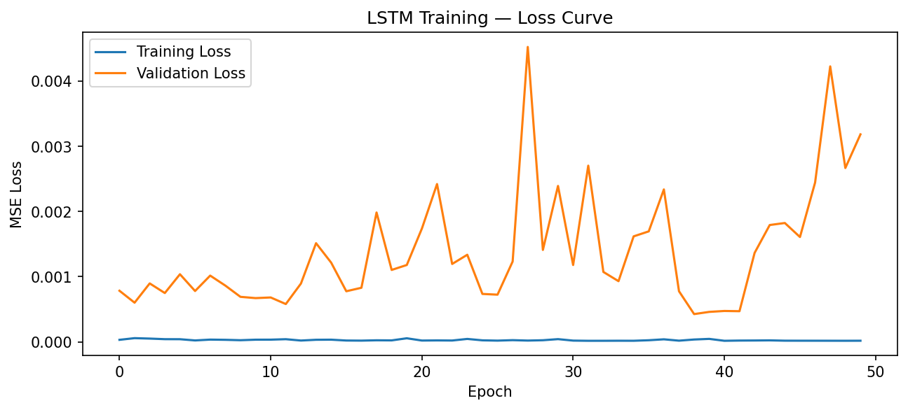
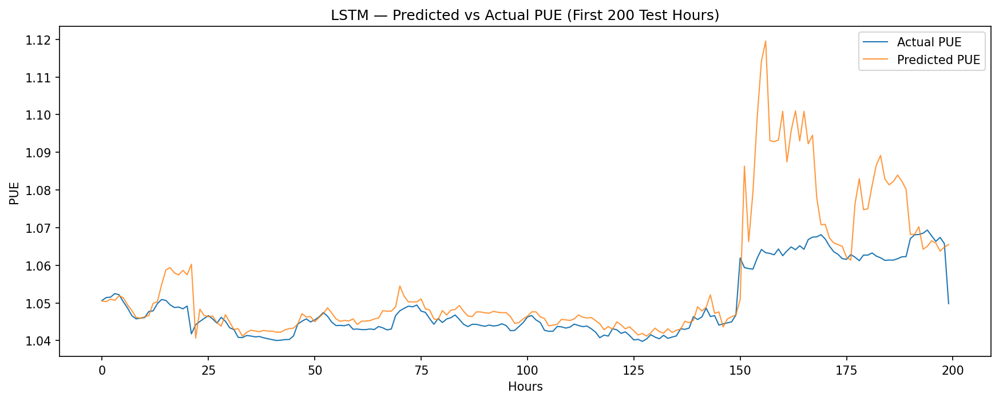

<h1 align="center">

</h1> 

# NLR HPC Facility Power Usage Effectiveness (PUE) Analysis

A decade-long analysis of Power Usage Effectiveness (PUE) 
data from the National Laboratory of the Rockies' 44 
petaflop HPC facility. This project covers data cleaning, 
statistical analysis, visualization, and LSTM-based 
forecasting of facility energy efficiency from 2016-2025.

## Background

PUE measures total facility power divided by IT equipment 
power, a PUE of 1.0 is the theoretical minimum. World-class 
HPC facilities target below 1.2. Monitoring PUE at scale 
enables anomaly detection, cost reduction, and compliance 
reporting to Department of Energy stakeholders.

## Dataset

- **Source:** National Laboratory of the Rockies via data.nlr.gov
- **Power metrics:** 4.4M rows, minute-level, 2016-2025
- **Weather station:** 4.0M rows (outside air temp, humidity)
- **Features:** cooling_kw, hvac_kw, it_power_kw, 
  plug_and_light_kw, pump_kw, pue, outdoor_air_temp, 
  outdoor_air_humidity

## Project Structure

```
nlr-hpc-pue-analysis/
├── analysis/
│   ├── cleaning_analysis.ipynb
│   ├── plotting.ipynb
│   └── modeling.ipynb
├── data/           # excluded — see Dataset section
└── assets/
```

## Methodology

### Data Cleaning

Row-level null co-occurrence analysis revealed 136,486 rows 
with all five power sensors null simultaneously to the tune of 99.97% 
co-occurrence indicating system-wide telemetry outages rather 
than individual sensor failures. These were dropped rather 
than imputed. ERE was dropped due to algebraic derivation 
from PUE (target leakage). energy_reuse was dropped due to 
sentinel zeros and physically impossible negative values. 
The power and weather dataframes were joined via left join 
with forward fill which is physically defensible because temperature 
changes slowly relative to the 1-hour resampling window.

### Feature Engineering

Lag features (t-1, t-2, t-3, t-6, t-12, t-24) give the 
model explicit memory of recent PUE history. First differences 
capture rate of change — whether PUE is rising or falling 
and how fast. Rolling 24-hour mean captures the slow-moving 
underlying trend separate from hourly noise. Time-based 
features (hour, day of week, month) encode operational cycles.

### Modeling Approach

ACF showed persistent autocorrelation across all 48 lags, 
remaining above 0.6 at lag 48, confirming strong temporal 
memory. PACF dropped to near zero after lag 2, indicating 
direct predictive power concentrates in the two most recent 
hours. Together these justify an LSTM with a 24-hour sequence 
window over simple regression. A persistence baseline 
(predict next hour = current hour) and Random Forest feature 
importance check preceded the LSTM to establish benchmarks 
and validate feature selection.

## Key Findings

### PUE Distribution

95% of readings cluster between 1.03-1.08 (world-class 
efficiency) with a long right tail of spike events.

### PUE Over Time — 2016-2025

Facility maintains stable efficiency with episodic spikes. 
The 2024-2025 period shows elevated baseline PUE consistent 
with increasing AI/HPC compute load.

### Anomaly Detection

99th percentile threshold flags cooling events and load 
surges against the normal operating band.

### Correlation Matrix

hvac_kw (0.59) and pump_kw (0.36) show the strongest correlation with PUE. 
Cooling and water circulation overhead are the primary drivers of facility efficiency.
IT power load correlates most strongly with pump_kw (0.72) and hvac_kw (0.54), confirming that compute demand drives cooling overhead which in turn drives PUE.

### Feature Importance

pue_lag_1 explains 78.7% of variance. PUE is highly 
persistent hour-to-hour. Rate of change features 
(pue_diff_1, pue_diff_24) contribute the next 16%.

## Model Results

| Metric | Persistence Baseline | LSTM |
|--------|---------------------|------|
| MAE    | 0.0015 PUE units    | 0.0291 PUE units |
| RMSE   | 0.0070              | 0.0564 |
| R²     | 0.9742              | -0.6066 |
| MAPE   | 0.13%               | 2.66% |

### Loss Curve


### Predicted vs Actual


### Diagnosis

The LSTM underperformed the persistence baseline due to 
overfitting, training loss near zero while validation loss 
was 10-100x higher and unstable. With pue_lag_1 explaining 
78.7% of variance, the 24-feature model was overparameterized 
for this problem. The model tracked normal operations well 
but diverged significantly at regime changes (hour ~150), 
predicting spikes that didn't materialize.

## Next Steps

- Reduce feature set to top 5 by importance
- Simplify architecture to 1 layer, 32 hidden units  
- Add early stopping (patience=10)
- Wrap inference in FastAPI endpoint with 
  Prometheus/Grafana observability layer

## Environment

Python 3.11 · PyTorch · scikit-learn · pandas · 
statsmodels · matplotlib · seaborn

## Data Source
[NLR HPC Facility PUE Dataset](https://data.nlr.gov/submissions/300) · 
[PUE Methodology](https://www.nlr.gov/computational-science/measuring-efficiency-pue)
